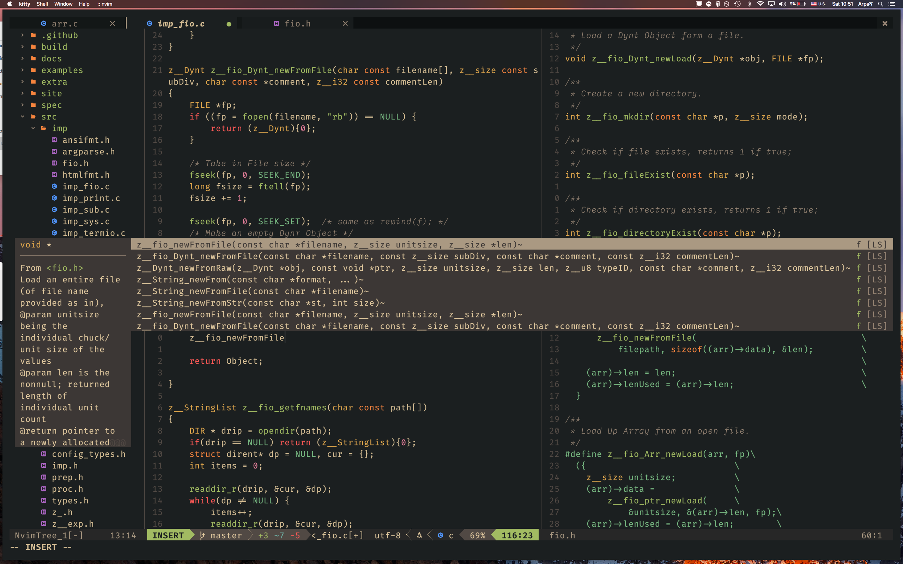

# NeoVim Config

<div align="center">
  
  My Personal Neovim Config.
</div>

## Install

This neovim config uses [packer](https://github.com/wbthomason/packer.nvim) for managing packages. Install it first

Clone the Repo
```sh
git clone https://github.com/zakarouf/nvim-config
```

Move The Repository
```sh
mv ~/.config/nvim ~/.config/nvim-old # keep an backup of your old config
mv nvim-config ~/.config/nvim
```

